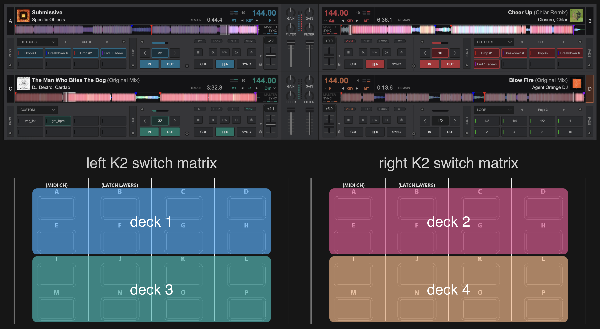

# Xone Viv2 - A 2x2 deck, hybrid setup VDJ mapping

The mapping I use for my 2 K2s with VirtualDJ.
Meant for use with either an external mixer,
or a separate controller representing a mixer.
Opinionated, yet feature rich.
Consists of two files,
one for each controller.

WIP.

## Features:

### 16 pages of functionality

The functionality of the latch layer button
has been reworked from the ground up.
It accesses a menu page where
where buttons A-P represent a sub-menu each.
This means 16 pages in total,
some still unmapped.
This means all of the LED colors 
are available as well!

### Consistent, non mirrored deck control layout

Decks are laid out vertically,
exactly like they are shown in Virtual DJ
to reduce mental overhead
and misinputs.

### Extensive track browser filtering

WIP

## Manual
Found [here](documentation/VDJ-XoneViv2-Manual.pdf). 

Since it's generated using [Typst](https://typst.app), 
anyone who wants to edit this mapping to their liking
can easily render their own manual 
while they're at it it.

